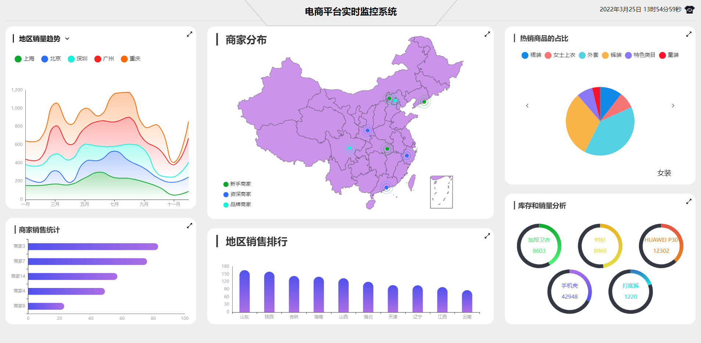

# 可视化项目

本项目为前后端分离的基于Vue数据可视化项目，目的为学习Vue结合echarts的使用。

**仅供于个人学习和练习。**


## 启动步骤

```
1.后端文件夹koa_server
$ npm install / cnpm install
$ node app.js

2.前端项目
$ npm install / cnpm install
$ npm run serve 
```


## 技术栈使用

### 后端

- koa2

- WebSocket

### 前端

- vue2   vue-cli   vuex vue-router
- echarts
- WebSocket
- webpack


## 实现功能

- 实时时间显示
- 结合vue和echarts完成了线型图，柱形图，饼图和地图等形式的数据可视化
- 单个图表的放大全屏功能
- 图表的自动滚动功能
- 不同数据的切换菜单功能
- 地图展示，点击省份切换相应省份地图，双击回到全国地图
- 利用监控浏览器窗口大小变化改变文字和图例的尺寸来实现分辨率自适应


## 效果展示

默认主题：亮白



更换主题：黑夜


单个图表全屏显示


省份地图显示


后端


